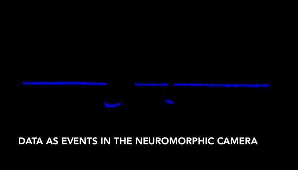
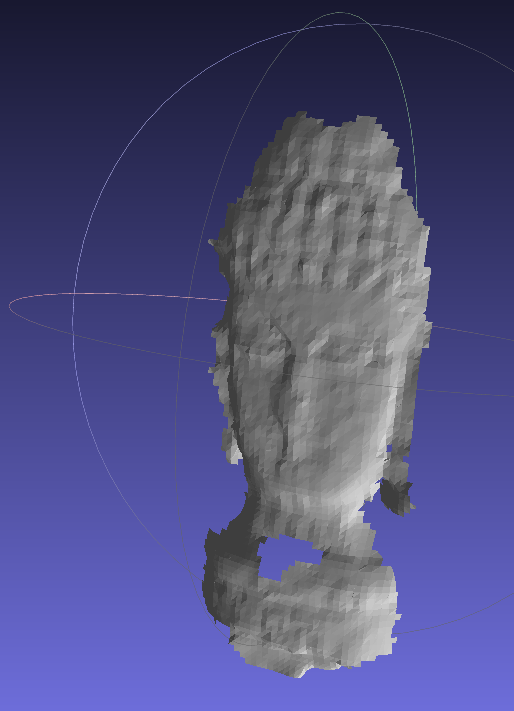
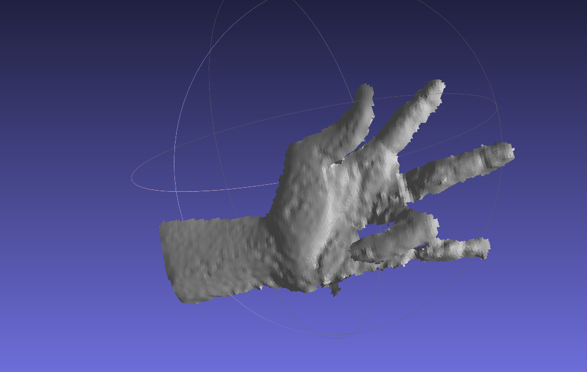
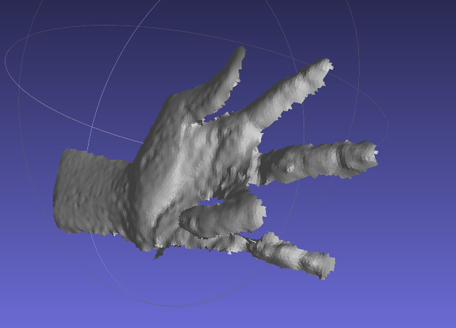
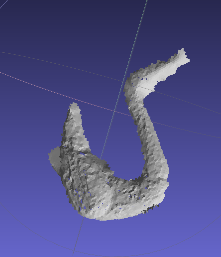
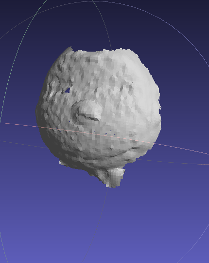
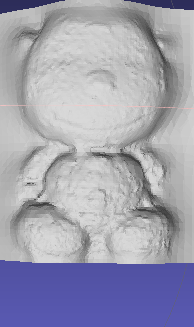

# Motion Contrast 3D Scanning

This repo contains implementation of the motion contrast 3-D Scanning method proposed by <a href="http://compphotolab.northwestern.edu/wordpress/wp-content/uploads/2015/04/dvs_031.pdf"> Matsuda et. al</a>. Check out the project page <a href=http://compphotolab.northwestern.edu/project/mc3d-motion-contrast-3d-laser-scanner/>here</a> and the video to the project <a href=https://vimeo.com/125511538>here</a>.

The data in the experiments folder have been collected from a DAVIS346 Camera. The  <a href="https://github.com/uzh-rpg/rpg_dvs_ros">drivers </a> developed by the robotics and perception group were used to collect data from the DAVIS. 

An object is placed on a platform and a moving light source generated in `generator.py` is made to fall on the object. The videos folder contains different light sources generated using the generator file. The gif on the left shows the experimental setup and the gif on the right shows the events visualised by accumulating them to frames at a particular rate

<table style="width:100%">
    <tr>
        <td style="text-align:center"> </td>
        <td style="text-align:center"> </td>
    </tr>
</table>

The event camera, placed in a stereo configuration with the <a href="http://www.ti.com/tool/DLPLCR4500EVM">light projector</a> ,records the bending of the incident light. This property is used to calculate the depth of the scene specified in more detail in the paper.

To run the files execute with the following command 

`python main.py`

To run for different object change the `obj` and `offset` variables in the `main_line_scanning()` function in the `main.py` file. In case you are using a camera other than DAVIS346, camera dimensions can be changed by changing the `cam_dims` variable. The output is a .xyz file. The .xyz files can be imported in meshlab and meshed to get 3D results.

Below are some of the results of the Implementation.

<table style="width:100%">
    <tr>
        <td style="text-align:center"> </td>
        <td style="text-align:center"> </td>
        <td style="text-align:center"> </td>
    </tr>
    <tr>
        <td style="text-align:center">  </td>
        <td style="text-align:center">  </td>
        <td style="text-align:center">  </td>
    </tr>
</table>

To understand how events occur in an event based camera, please watch the video at this <a href="https://www.youtube.com/watch?v=kPCZESVfHoQ">link.</a>

Below are the links to different types of Event Cameras,

1. <a href="http://inivation.com/"> DAVIS </a>

2. <a href="https://www.prophesee.ai/"> ATIS </a>
